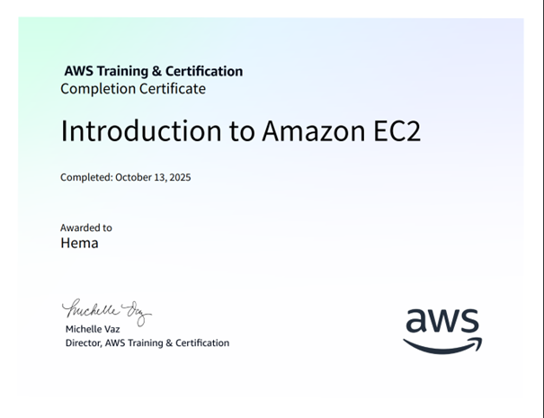
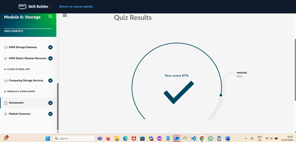
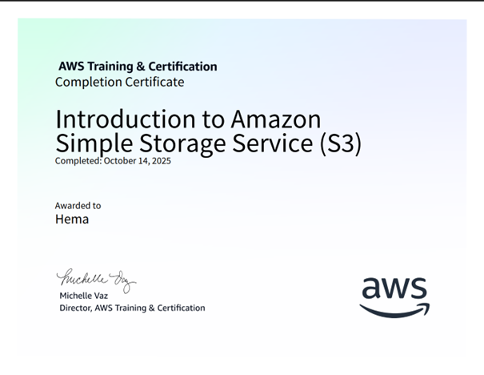

# Week 02 – AWS Hands-on Labs ☁️

This week focuses on applying AWS fundamentals through Skill Builder labs and continuing the Cloud Practitioner Essentials course.  
The goal is to reinforce theoretical concepts with hands-on experience using **EC2** and **S3**.

---

## 🎯 Learning Goals
- Practice launching and managing EC2 instances.  
- Explore AWS storage services, especially S3.  
- Understand core storage concepts like durability, scalability, and cost efficiency.  
- Strengthen theoretical understanding through Cloud Practitioner Essentials (Module 6).  

---

## 🧩 Labs & Modules Completed
| Activity | Description | Status | Evidence |
|-----------|--------------|---------|-----------|
| **Introduction to Amazon EC2 (Lab)** | Learned to launch, connect to, and terminate EC2 instances; understood instance types, AMIs, and regions. | ✅ Completed |  |
| **Cloud Practitioner Essentials – Module 6: Storage** | Covered AWS storage services (S3, EBS, EFS, Glacier). Completed quiz with 87%. | ✅ Completed |  |
| **Introduction to Amazon S3 (Lab)** | Created S3 buckets, uploaded objects, explored permissions and versioning. | ✅ Completed |  |

---

## 🧠 Reflection
This week built directly on the compute concepts from last week’s EC2 theory.  
Completing the EC2 and S3 labs helped connect theory to practice — especially understanding **how resources are provisioned and secured** in AWS.  
Module 6 on storage gave valuable background before the S3 lab, making it easier to follow the concepts of *durability, redundancy,* and *scalability*.  
Next, I plan to continue with IAM and billing-related hands-on labs to complete the AWS fundamentals track.

---

## 📸 Screenshots Folder
All certificates and quiz results are stored in the `/screenshots/` subfolder.  
Each image corresponds to the labs and modules completed this week.
