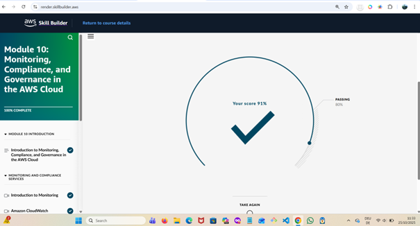
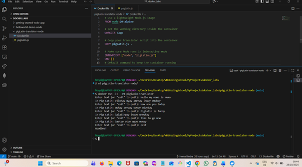
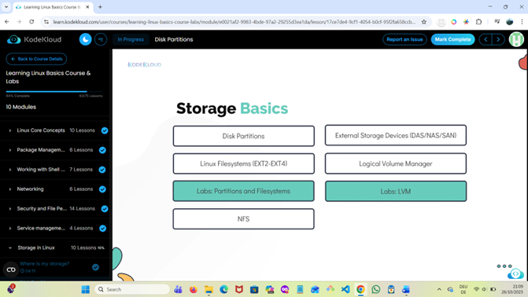

# 🐳 Week 3 – Docker Deep Dive

**Focus:** Containerization fundamentals with Docker and Docker Compose  
**Duration:** Week 3 of 8 (DevOps Foundations Practice Plan)

---

## 🎯 Learning Goals

- Understand the purpose and advantages of containerization (vs. VMs)  
- Install and configure Docker & Docker Compose locally  
- Containerize simple Node.js and JavaScript applications  
- Use Docker Compose to run a multi-container stack (frontend + backend + database)  
- Explore Docker networking and volumes for data persistence  
- Build and push custom images to Docker Hub  
- Strengthen Linux knowledge through hands-on troubleshooting  

---

## 🧰 Tools & Setup

| Tool | Purpose |
|------|----------|
| **Docker Desktop / Engine** | Build, manage, and run containers |
| **Docker Compose** | Define and orchestrate multi-container applications |
| **VS Code / Terminal** | Development environment and CLI interface |
| **Node.js / JavaScript Apps** | Used for containerization practice (To-Do App, Pig Latin Translator) |
| **Docker Hub** | Image registry for storing and sharing built images |
| **KodeKloud Linux Environment** | Practiced related Linux commands for container management and networking |

---

## 🪄 Week 3 Reflection

This week represented a major milestone in my DevOps learning journey — moving from foundational Linux and AWS concepts into **hands-on containerization** with Docker.  

I started by following *TechWorld with Nana’s “Learn Docker in 2025” roadmap* and the official *Docker Get Started* guide to solidify both theoretical understanding and CLI practice.  
By completing **Docker Fundamentals**, I practiced:
- Pulling, running, stopping, and removing containers (e.g., Nginx)  
- Mapping ports (`-p 8080:80`) and managing container lifecycle commands  
- Exploring the Docker Desktop dashboard for monitoring container logs and activity  

Next, in **Developing with Containers**, I cloned and ran the *Docker Getting Started To-Do App* using `docker compose watch`.  
This created a **multi-container setup** with a React frontend, Node backend, and MySQL database.  
I inspected the automatically created **Docker network and volume**, learning how data persists across container restarts.

Following this, I advanced to **building custom images** using a `Dockerfile`.  
I created and pushed my **first image** to Docker Hub — resolving an authentication issue by logging into Docker Desktop via CLI.  
Then, I containerized one of my earlier **bootcamp projects**, a JavaScript CLI app (Pig Latin Translator), successfully building and running it in a local container.

By the end of the week, I had a solid grasp of:
- Docker image creation and tagging  
- Multi-container orchestration using Compose  
- Volumes and networks for persistent, connected services  
- Troubleshooting through logs, permissions, and port conflicts  

In parallel, I continued the **AWS Cloud Practitioner Essentials** course (completed *Module 10: Monitoring, Compliance & Governance* with a 91% score)  
and advanced the **KodeKloud Linux Basics** course to **84%**, covering *Security, iptables, cron jobs,* and *systemctl service management.*

---

## 🧩 Highlights
- Verified **Docker setup** and ran first container (`hello-world`, `nginx`)  
- Completed **Docker Compose** multi-service app with live reload (`docker compose watch`)  
- Explored **Docker networking** (bridge networks, service communication)  
- Practiced **data persistence** with Docker volumes  
- Built and pushed first custom **Docker image** to Docker Hub  
- Containerized a personal **bootcamp project** for the first time  
- Strengthened Linux system administration and AWS fundamentals in parallel  

---

## 🗓️ Next Steps

- Continue **Docker practice** by containerizing more bootcamp web apps and refining Dockerfile skills.  
- Enroll in and complete **KodeKloud – Docker for the Absolute Beginner** (4-hour course) to reinforce fundamentals through guided labs.  
- Begin **Week 4 – Kubernetes Intro**, focusing on container orchestration with **Minikube** and `kubectl`.  
- Continue **AWS Cloud Practitioner Essentials** (remaining modules) to complete the 12.5-hour course.  
- Complete **KodeKloud Linux Basics** to reach 100% and summarize key system management concepts.  
- Document Kubernetes exercises, AWS progress, and additional Docker labs in the Week 4 folder.

---

## 🖼️ Screenshots & Evidence

| Activity | Description | Status | Evidence |
|-----------|--------------|---------|-----------|
| **Running and Managing the Nginx Container** | Verified Docker installation and commands using the Nginx image. Practiced `docker pull`, `docker run`, `docker ps`, `docker stop`, and `docker rm`. | ✅ Completed |  |
| **To-Do App Containers Running in Docker Desktop** | Executed `docker compose watch` for the *Getting Started To-Do App*. Observed multiple containers (frontend, backend, DB) running simultaneously. | ✅ Completed |  |
| **To-Do App Frontend in Browser** | Confirmed successful deployment of multi-container setup; web app accessible in browser. | ✅ Completed |  |
| **AWS Cloud Practitioner Essentials – Module 10 Quiz** | Completed *Monitoring, Compliance & Governance* module with a **91 %** score. | ✅ Completed |  |
| **Dockerized Pig Latin Translator App** | Built Dockerfile for a bootcamp project (JavaScript CLI app), created image, and ran container successfully. | ✅ Completed |  |
| **KodeKloud Linux Basics Progress (84 %)** | Continued Linux Basics for DevOps course – covered networking, security, and file permissions labs. | ✅ In Progress |  |

---

📸 *All screenshots captured between Oct 20 – 27 2025 as part of Week 3 ( Docker Deep Dive ) of my 8-Week DevOps Foundations Plan.*

---
