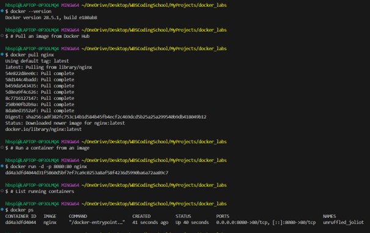
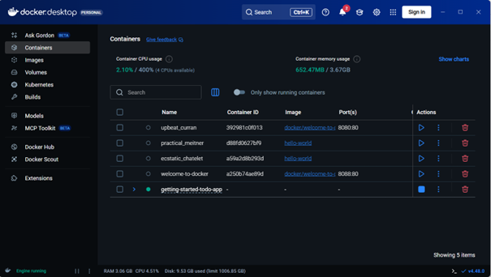
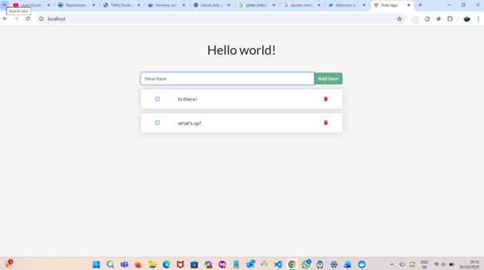

# 🐳 Week 3 – Docker Deep Dive

**Focus:** Containerization fundamentals with Docker and Docker Compose  
**Duration:** Week 3 of 8 (DevOps Foundations Practice Plan)

---

## 🎯 Learning Goals

- Understand the purpose and advantages of containerization (vs. VMs)  
- Install and configure Docker & Docker Compose locally  
- Containerize a simple Node.js application  
- Use Docker Compose to run a multi-container stack (app + database)  
- Push images to Docker Hub  
- Strengthen Linux knowledge through hands-on troubleshooting  

---

## 🧰 Tools & Setup

| Tool | Purpose |
|------|----------|
| **Docker Desktop / Engine** | Build and run containers |
| **Docker Compose** | Multi-container orchestration |
| **VS Code / Terminal** | Editing and CLI |
| **Node.js App** | Sample app for containerization |
| **Docker Hub** | Store and share images |

---

## 🪄 Week 3 Reflection

This week marked a major turning point — transitioning from foundational AWS and Linux skills to practical **containerization** with Docker.  
I began by revisiting the basics through *TechWorld with Nana’s “Learn Docker in 2025” roadmap* and the official *Docker Get Started* guide, which helped reinforce both conceptual understanding and real-world application.

By completing **Phase 1 – Docker Fundamentals**, I practiced managing containers through the CLI:
- Pulling and running official images (e.g., Nginx)  
- Mapping ports and managing container lifecycle commands (`run`, `stop`, `rm`, `ps`)  
- Inspecting containers via Docker Desktop’s dashboard  

In **Phase 2 – Developing with Containers**, I cloned and ran the *Docker Getting Started To-Do App* using `docker compose watch`, observing multiple services (React front end, Node back end, and database) running together.  
Inspecting these containers and their networks helped me understand how Docker Compose orchestrates multi-container applications — an essential DevOps skill.

Along the way, I encountered minor build and networking challenges, which I resolved by cross-referencing the Docker documentation and inspecting container logs.  
This process deepened my troubleshooting confidence and improved my understanding of how containerization simplifies setup, consistency, and deployment.

Next, I plan to:
- Complete the remaining *Developing with Containers* exercises  
- Explore **Docker volumes and networking**  
- Begin preparing for **Week 4 – Kubernetes Intro**, where I’ll deploy Dockerized apps using Minikube and KodeKloud labs.

---
---

## 📸 Screenshots

### 1️⃣ Running and Managing the Nginx Container  
This screenshot shows the Visual Studio Code terminal where I:  
- Pulled the Nginx image from Docker Hub  
- Ran it with port mapping (`docker run -d -p 8080:80 nginx`)  
- Verified running containers, then stopped and removed it  

  

---

### 2️⃣ Docker Desktop – To-Do App Containers Running  
After running `docker compose watch` from the *Getting Started To-Do App* folder, multiple containers (React front-end, Node back-end, and DB service) launched successfully.  
This screenshot shows the Docker Desktop interface listing all running containers and their statuses.

  

---

### 3️⃣ To-Do App Frontend in Browser  
The To-Do web app frontend displayed successfully, confirming that the containerized full-stack setup (front-end + back-end + database) was working correctly.

  

---

---
