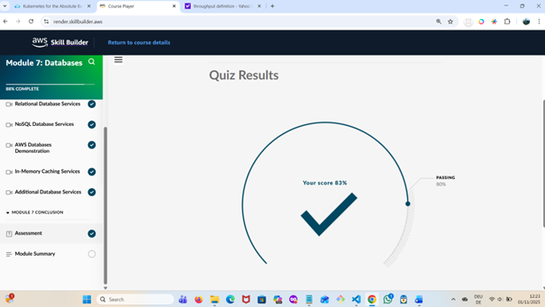
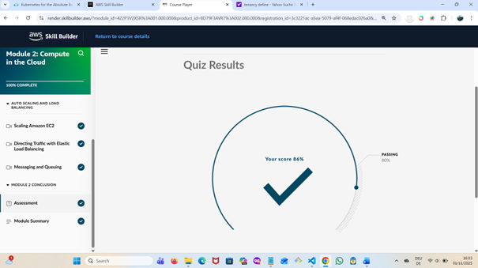
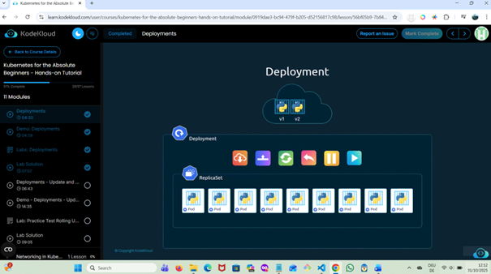
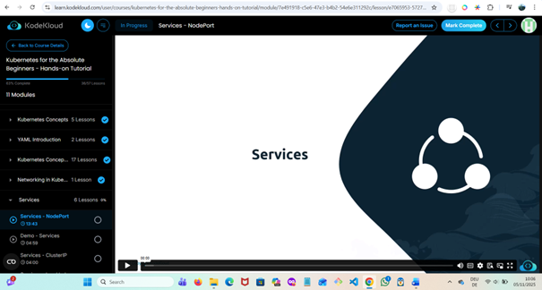

# ☸️ Week 4 – Kubernetes Intro & Orchestration  

**Focus:** Understanding Kubernetes architecture and orchestration concepts before hands-on setup  
**Duration:** Week 4 of 8 (DevOps Foundations Practice Plan)  
**Date Range:** Oct 29 – Nov 5, 2025  

---

## 🎯 Learning Goals  

- Grasp the **core concepts of Kubernetes** — what it is, why it’s used, and how it manages containerized applications  
- Understand **Kubernetes architecture**: Pods, Nodes, Deployments, Services, and the Control Plane  
- Learn how Kubernetes builds upon Docker concepts (containers, images, networking)  
- Follow the **KodeKloud “Kubernetes for Absolute Beginners”** course to build a conceptual foundation  
- Prepare for upcoming **hands-on setup** with Minikube and kubectl  
- Continue parallel learning:  
  - **AWS Cloud Practitioner Essentials** (Modules 2, 7)  
  - Complete **KodeKloud Linux Basics** (100%)  

---

## 🧰 Tools & Learning Resources  

| Tool / Platform | Purpose |
|------------------|----------|
| **KodeKloud Kubernetes for Absolute Beginners** | Primary course for theory and guided labs |
| **Minikube (planned)** | Local single-node Kubernetes cluster for testing |
| **kubectl** | Command-line tool to interact with Kubernetes clusters |
| **Docker Desktop** | Underlying container runtime for local practice |
| **AWS Skill Builder** | Continuing Cloud Practitioner modules |
| **KodeKloud Docker & Linux Labs** | Reinforcing Docker and system administration fundamentals |

---

## 📘 Progress Summary (as of Nov 4, 2025)

I officially began **Week 4** on **October 29, 2025**, focusing on the **KodeKloud – Kubernetes for Absolute Beginners** course.  
Throughout the week, I made steady progress—advancing from basic Pod concepts to more complex Kubernetes objects.  
By **Day 4**, I reached **53% completion**, having covered:

- YAML fundamentals and Kubernetes object structures  
- Pod creation and management via KodeKloud labs  
- Understanding **Replication Controllers** and **ReplicaSets**  
- Introduction to **Deployments** — scaling, self-healing, and rolling updates  

In parallel, I revisited **AWS Cloud Practitioner Essentials**, strengthening my understanding of cloud fundamentals:  
- Completed **Module 7 – Databases**, scoring **83%**  
- Revisited and completed **Module 2 – Compute in the Cloud**, scoring **86%**

This week also consolidated two essential DevOps foundations: **Linux systems administration** and **Kubernetes orchestration**.

- **Linux Basics for DevOps (KodeKloud)** – ✅ *Completed (100%)*  
  - Covered disk partitioning, file systems, storage types (DAS, NAS, SAN), NFS, and LVM  
  - Practiced commands (`mkfs`, `mount`, `blkid`) and completed hands-on storage labs  
  - Earned a **certificate of completion** 🎓  

- **Kubernetes for Absolute Beginners (KodeKloud)** – *Progress: 60%*  
  - Completed Deployments → Update & Rollback modules with labs  
  - Practiced commands: `kubectl set image`, `rollout status`, `rollout undo`  
  - Plan to install **Minikube** after completing the remaining modules  

By the end of Week 4, I strengthened my Linux infrastructure skills while deepening my understanding of container management and cluster operations in Kubernetes.  

This blend of **container orchestration** and **cloud service learning** continues to enhance my grasp of how DevOps unites automation, scalability, and infrastructure management in real-world practice.

### 🔑 Key Concepts Covered So Far

#### ☸️ Kubernetes (KodeKloud – Kubernetes for Absolute Beginners)
- **YAML Fundamentals:** Learned how Kubernetes objects are defined declaratively using YAML files with `apiVersion`, `kind`, `metadata`, and `spec` fields.  
- **Creating Pods with YAML:** Practiced writing Pod manifests and deploying them via KodeKloud labs, understanding how Pods act as the smallest deployable units in Kubernetes.  
- **Replication Controllers & ReplicaSets:** Learned how ReplicaSets maintain the desired number of Pod replicas and ensure self-healing if a Pod fails.  
- **Deployments:** Explored how Deployments manage ReplicaSets and support rolling updates, rollbacks, and version control for application updates.  
- **Declarative vs Imperative Management:** Gained a clearer understanding of why Kubernetes favors declarative state management (`kubectl apply`) over direct imperative commands.  
- **Cluster Architecture (Recap):** Reinforced the roles of the Control Plane components (API Server, Scheduler, Controller Manager, etc.) and Worker Nodes in maintaining cluster stability.  

#### ☁️ AWS Cloud Practitioner Essentials (Parallel Learning)
- **Module 7 – Databases:** Learned about AWS database options including **RDS**, **DynamoDB**, **Aurora**, and **Redshift**; completed with an **86%** quiz score.  
- **Module 2 – Compute in the Cloud (Revisited):** Revisited EC2 concepts (instances, AMIs, scaling, pricing models) and completed the quiz with **86%**.  
- Strengthened understanding of how compute, storage, and database services integrate within AWS architectures — valuable context for deploying containerized apps later.  
#### Week 4 Highlights – Linux & Kubernetes Advancement

**Linux Storage & File Systems**
- Explored physical and logical storage (DAS, NAS, SAN) concepts.  
- Practiced mounting file systems (`mkfs`, `mount`, `blkid`) and configuring NFS shares.  
- Implemented LVM (Logical Volume Management) in KodeKloud labs for flexible storage allocation.  
- Completed *Linux Basics for DevOps* (100 %) and earned certificate.

**Kubernetes Deployments & Rollouts**
- Mastered how Deployments manage ReplicaSets and enable rolling updates and rollbacks.  
- Practiced commands: `kubectl set image`, `kubectl rollout status`, `kubectl rollout undo`.  
- Gained hands-on experience controlling application version updates and ensuring cluster stability.  
- Reached 60 % in *Kubernetes for Absolute Beginners* course.  

---

🧭 *Up next:* Continue Kubernetes course to cover **Services**, **ConfigMaps**, and **Secrets**, then begin **Minikube setup** and `kubectl` practice.

---

## 🗓️ Next Steps  

- Continue the **KodeKloud Kubernetes for Absolute Beginners** course to cover:
  -   Services (ClusterIP, NodePort, LoadBalancer)
  -   ConfigMaps and Secrets
  -   **kubectl** command practice for Deployments and Services
- Explore **Services** and how Kubernetes exposes applications  
- Set up **Minikube** and practice creating Pods and Deployments once setup lessons appear
- Finish **Linux Basics** course and summarize key commands and concepts
- Add YAML and CLI output screenshots to /week04_kubernetes/screenshots/.

---

## 🖼️ Screenshots & Evidence

| **Activity** | **Description** | **Status** | **Evidence** |
|---------------|------------------|-------------|---------------|
| **AWS Cloud Practitioner Essentials – Module 7 (Databases)** | Completed the Databases module covering RDS, DynamoDB, Aurora, and Redshift. Scored **83%** in the final quiz. | ✅ Completed |  |
| **AWS Cloud Practitioner Essentials – Module 2 (Compute in the Cloud)** | Revisited and completed the Compute module focusing on EC2, instance types, AMIs, and scaling. Scored **86%** in the quiz. | ✅ Completed |  |
| **KodeKloud – Kubernetes for Absolute Beginners** | Continued Kubernetes learning to **51% completion**. Covered YAML fundamentals, Pods, ReplicaSets, and Deployments through interactive labs. | ✅ In Progress |  |
| **KodeKloud Linux Basics for DevOps – Course Completion** | Completed all modules including storage, NFS, and LVM. Earned certificate of completion. | ✅ Completed |  |
| **Kubernetes for Absolute Beginners – 60 % Progress** | Continued through Deployments (Updates & Rollbacks) with hands-on labs. | ✅ In Progress |  |

---

📸 *All screenshots were captured during Week 4 (Oct 29 – Nov 5, 2025) as part of the Kubernetes Intro & AWS parallel learning phase of my 8-Week DevOps Foundations Practice Plan.*

---
📘 These notes reflect progress up to 53% completion of the KodeKloud Kubernetes for Absolute Beginners course (as of Nov 1, 2025), as part of my 8-Week DevOps Foundations Practice Plan.

---
