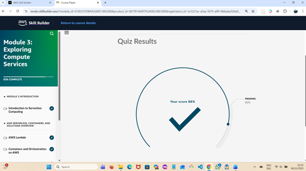
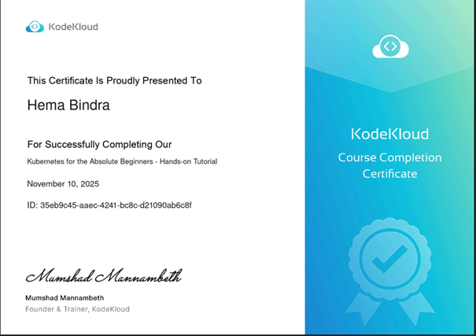
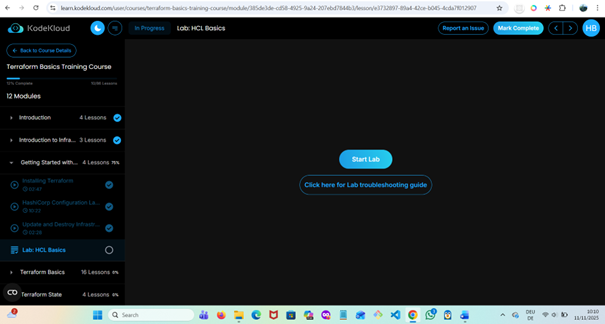

# 🌍 Week 5 – Kubernetes & Infrastructure as Code (Terraform)

**Focus:** Completing Kubernetes fundamentals (Minikube, Services, ConfigMaps, Secrets) and beginning Infrastructure as Code (IaC) with Terraform.  
**Duration:** Week 5 of 8 (DevOps Foundations Practice Plan)

---

## 🎯 Learning Goals

- Complete *Kubernetes for Absolute Beginners* course (KodeKloud) and set up **Minikube** locally.  
- Practice deploying Pods and Services using `kubectl` and YAML manifests.  
- Understand **Infrastructure as Code (IaC)** concepts using **Terraform**.  
- Install Terraform and configure AWS as a provider.  
- Create first `.tf` configuration to deploy a resource (EC2 / S3) in AWS.  
- Continue AWS Cloud Practitioner course (Modules 11–12).  
- Document all commands, YAML manifests, Terraform scripts, and screenshots.

---

## 🧩 Labs & Courses

| **Platform / Course** | **Focus Area** | **Status** | **Notes / Highlights** |
|------------------------|----------------|-------------|--------------------------|
| **KodeKloud – Kubernetes for Absolute Beginners** | Completed Deployments, Services, ConfigMaps, Secrets. 100% course completion 🎓 | ✅ Completed | Observed multi-tier microservices demo (Redis + Postgres + Node + Python). Next: *Hello Minikube* tutorial. |
| **Official Kubernetes Docs** | *Hello Minikube* Tutorial | 🔄 In Progress | Setting up local cluster and testing deployment. |
| **KodeKloud – Terraform for Beginners** | IaC, Terraform CLI, HCL basics, Providers | 🚧 In Progress (12%) | Learned Terraform syntax, state files, and initialization steps. Preparing for hands-on labs. |
| **AWS Skill Builder – Cloud Practitioner Essentials** | Modules 3 & 11–12 | ✅ Ongoing | Completed Module 3 (Compute Services) with **88%** score; continuing next modules. |

---

## ⚙️ Tools & Setup

| **Tool** | **Purpose / Usage** |
|-----------|----------------------|
| **Minikube** | Local Kubernetes cluster for practice. |
| **kubectl** | Kubernetes CLI for managing Pods, Deployments, and Services. |
| **Terraform CLI** | Infrastructure as Code tool for automating AWS resource provisioning. |
| **AWS CLI** | AWS credentials configuration for Terraform provider setup. |
| **VS Code** | IDE for writing `.yaml` and `.tf` configuration files. |

---

## 🧠 Reflection

This week marked a transition from container orchestration to infrastructure automation.  
After completing the *Kubernetes for Absolute Beginners* course, I gained a strong grasp of Services, ConfigMaps, and Secrets — understanding how Kubernetes connects multiple application components.  

Starting Terraform introduced the **Infrastructure as Code** mindset: defining cloud infrastructure through reusable configurations instead of manual setup.  
Although Week 5 was slower due to family commitments, meaningful progress was made in aligning DevOps fundamentals with automation practices.

---

## 📘 Progress Summary (as of Nov 10 2025)

Despite a busy week with family commitments, steady progress was made across AWS, Kubernetes, and Terraform foundations.

- **AWS Cloud Practitioner Essentials – Module 3 (Compute Services)** ✅ Completed  
  - Covered EC2, ECS, EKS, Lambda, and serverless architectures.  
  - Scored **88 %** in the quiz.  
  - Reinforced links between AWS orchestration (ECS/EKS) and Kubernetes concepts.

- **Kubernetes for Absolute Beginners (KodeKloud)** 🎓 **100 % Complete**  
  - Practiced Deployments, Services, ConfigMaps, and Secrets via YAML and CLI.  
  - Completed microservices demo labs (Redis, Postgres, Python/Node.js apps).  
  - Observed real-world setups on AWS, GCP, and Azure; introduction to `kubeadm`.  
  - Ready to set up **Minikube** and recreate similar deployments locally.

- **Terraform for Beginners (KodeKloud)** 🌱 Started (12 %)  
  - Introduced to Infrastructure as Code principles and HCL syntax.  
  - Will resume labs on HCL Basics and build first Terraform config in Week 6.

---

## 🖼️ Screenshots & Evidence

| **Activity** | **Description** | **Status** | **Evidence** |
|---------------|------------------|-------------|---------------|
| **AWS Cloud Practitioner – Module 3 Quiz** | Covered Compute Services, Containers, and Serverless; scored **88%**. | ✅ Completed |  |
| **Kubernetes for Absolute Beginners – 100%** | Completed all modules and labs on KodeKloud. | ✅ Completed |  |
| **Terraform for Beginners – 12%** | Started Terraform course; covered basics of HCL and IaC concepts. | 🚧 In Progress |  |
